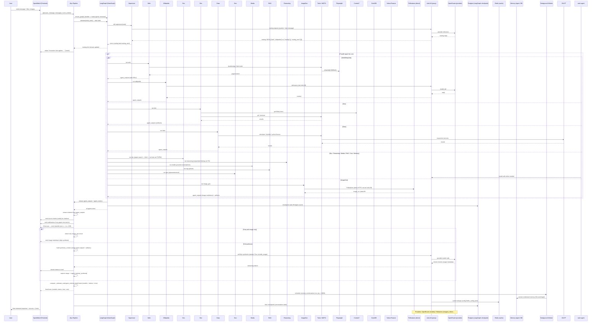

# Alyx Pipeline

Alyx est une pipeline multi-agents pour Open WebUI, construite autour de LangGraph, LiteLLM et MCPO. Le projet orchestre plusieurs agents spécialisés pour répondre à des demandes conversationnelles, documentaires, techniques, visuelles ou analytiques, tout en conservant une interface de chat unique côté Open WebUI.

Le dépôt contient :

- une stack Docker complète pour Open WebUI et ses dépendances ;
- une pipeline Python hébergée dans le conteneur `pipelines` ;
- un routeur supervisor qui choisit les agents à invoquer ;
- des agents spécialisés pour le web, Wikipédia, la recherche académique, le dev, la data, la géographie, les médias, le RAG, la mémoire et le raisonnement ;
- une couche d’events Open WebUI pour les statuts, notifications, sources et métadonnées de conversation.

## Schéma global

Le diagramme suivant représente le flux complet, du message utilisateur jusqu’à la réponse finale streamée.



---

## Vue d’ensemble de la stack

### Interface et orchestration

- `open-webui` fournit l’interface de chat, la gestion des conversations, le RAG applicatif et l’intégration avec Pipelines.
- `pipelines` héberge Alyx, le graphe LangGraph, les agents et la logique de synthèse finale.
- `litellm` unifie l’accès aux modèles et fournit le proxy LLM, le cache Redis et la gouvernance d’accès aux fournisseurs.

### Stockage et services support

- `postgres` stocke Open WebUI, LiteLLM et les checkpoints LangGraph sur des bases distinctes.
- `qdrant` sert de base vectorielle pour le RAG documentaire.
- `redis` sert de cache pour Open WebUI et LiteLLM, sur des bases logiques séparées.
- `tika` permet l’extraction de contenu documentaire côté Open WebUI.
- `mcpo` expose les outils MCP utilisés par les agents.
- `open-terminal` expose un terminal distant utilisable par certains workflows techniques.

### Modèles et routage LLM

La configuration par défaut passe par OpenRouter via LiteLLM. Les alias principaux déclarés dans [litellm_config.yaml](litellm_config.yaml) sont :

- `openrouter/qwen3.5-flash` pour Alyx, le supervisor, Wikipédia, le web et la géographie ;
- `openrouter/deepseek` pour la recherche documentaire, la data et le raisonnement ;
- `openrouter/kimi-k2.5` pour l’agent dev ;
- `openrouter/gpt-oss` pour les médias, la mémoire et le RAG.

La génération d’images ne passe pas par LiteLLM : l’agent `image_gen` appelle Pollinations directement.

## Architecture applicative

### Point d’entrée

Le point d’entrée est [sub_agents/alyx_pipeline.py](sub_agents/alyx_pipeline.py). Ce fichier gère :

- la conversion des messages Open WebUI ;
- l’exécution du graphe LangGraph ;
- l’émission des events Open WebUI ;
- la synthèse finale par Alyx ;
- les métriques de coût, de temps et de tokens ;
- la condensation mémoire en arrière-plan.

### Graphe LangGraph

Le graphe est défini dans [sub_agents/graph/builder.py](sub_agents/graph/builder.py) avec un schéma simple :

- `supervisor` décide quels agents lancer ;
- les agents sélectionnés s’exécutent en parallèle ;
- un second passage séquentiel peut être déclenché via `routing_next` ;
- le résultat consolidé revient à Alyx pour la synthèse finale.

L’état partagé est défini dans [sub_agents/graph/state.py](sub_agents/graph/state.py). Il contient notamment :

- `routing`, `routing_next` et `routing_phase1` pour l’orchestration ;
- `agent_outputs` pour les sorties textuelles ;
- `agent_metrics` pour les tokens et modèles ;
- `artifacts` pour les productions non textuelles ;
- `_pollinations` pour la configuration image.

### Supervisor

Le supervisor, dans [sub_agents/graph/supervisor.py](sub_agents/graph/supervisor.py), route les demandes selon le besoin :

- recherche encyclopédique et web ;
- littérature scientifique ;
- génération d’artifacts de dev ;
- calculs et données ;
- météo et géographie ;
- transcription et conversion média ;
- RAG documentaire ;
- mémoire conversationnelle ;
- raisonnement structuré ;
- génération d’image.

## Agents disponibles

### Agents de recherche et contenu

- `wikipedia` : contexte encyclopédique et définitions.
- `web` : recherche DuckDuckGo, lecture de pages et fallback Playwright.
- `doc` : recherche académique, DOI, accès Sci-Hub et synthèse scientifique.
- `rag` : recherche dans les documents importés dans Open WebUI.
- `media` : transcription YouTube et conversion documentaire.

### Agents d’exécution et de transformation

- `dev` : génération d’artifacts HTML, JS ou Python, appuyée par les skills locaux et Context7.
- `data` : calculs, DuckDB et données financières Yahoo Finance.
- `geo` : géocodage OSM et météo Open-Meteo.
- `image_gen` : génération d’image via Pollinations.

### Agents de contexte et analyse

- `memory` : rappel mémoire utilisateur et condensation asynchrone.
- `reasoning` : décomposition analytique à l’aide de `sequential-thinking`.

## Workflows

### Workflow direct

Pour une requête simple ou conversationnelle, Alyx peut répondre sans agent. Dans ce cas, le pipeline évite le coût du graphe et stream directement la réponse finale du modèle de synthèse.

### Workflow parallèle

Quand plusieurs agents sont indépendants, ils sont lancés en parallèle. Exemple typique :

- `wikipedia` + `web` pour une question factuelle nécessitant à la fois contexte et fraîcheur ;
- `doc` + `reasoning` pour une analyse fondée sur la littérature scientifique ;
- `web` + `wikipedia` + `doc` pour mixer actualité, contexte et publications.

### Workflow séquentiel

Quand un agent dépend explicitement de la sortie d’un autre, le supervisor peut retourner un objet de routage séquentiel :

```json
{"routing": ["data"], "routing_next": ["dev"]}
```

Le pattern principal est `collecte -> transformation`, par exemple :

- `data -> dev` pour construire un graphique à partir de données chiffrées ;
- `geo -> dev` pour construire une carte ;
- `web/wikipedia -> dev` pour générer une visualisation ou une page interactive à partir de contenus récupérés.

### Fast path image

Si seul `image_gen` est invoqué et qu’aucune synthèse textuelle n’est nécessaire, Alyx saute la synthèse finale et renvoie directement le résultat image. Cela réduit la latence sur les demandes de génération visuelle pure.

## Events Open WebUI

Le pipeline utilise les events Open WebUI pour enrichir l’expérience sans remplacer le flux principal du pipe.

### Events utilisés

- `status` pour afficher les étapes en temps réel ;
- `source` pour afficher les cartes de sources ;
- `notification` pour les avertissements d’agent ;
- `chat:title` pour proposer un titre de conversation au premier tour.

### Règle importante

Le contenu principal de la réponse continue à être envoyé par le `yield` du pipe, pas par des events `chat:message:delta` comme canal principal. C’est nécessaire pour conserver une persistance correcte côté Open WebUI.

### Raisonnement

Le raisonnement peut être affiché dans l’interface via les statuts temps réel, mais il ne doit pas être injecté dans la réponse finale. Deux sources existent :

- le raisonnement structuré des agents, surtout l’agent `reasoning` ;
- le `reasoning_content` éventuel du modèle de synthèse.

L’affichage de ces flux est piloté par valves dans la pipeline.

## Cas d’usage couverts

### Recherche factuelle et veille

- répondre à une question d’actualité avec contexte ;
- comparer des sources web et Wikipédia ;
- récupérer des informations fraîches avant synthèse.

### Recherche scientifique

- lister des publications récentes ;
- synthétiser l’état de l’art ;
- récupérer du texte intégral quand possible via Sci-Hub.

### Production technique

- générer un composant ou une démo HTML/JS ;
- produire un graphique interactif ;
- transformer des données récupérées en artifact visuel.

### Données et analytique

- calculer une expression ;
- interroger DuckDB ;
- récupérer une action, un ticker ou une donnée financière.

### Géographie et météo

- géocoder un lieu ;
- récupérer météo et coordonnées ;
- préparer une visualisation cartographique dans une seconde phase `dev`.

### Documents et médias

- interroger des documents importés dans Open WebUI ;
- extraire une transcription YouTube ;
- convertir un document externe en markdown exploitable.

## Configuration

### Prérequis

- Docker et Docker Compose ;
- des clés API selon les fournisseurs utilisés ;
- un fichier `.env` dérivé de [example.env](example.env).

### Variables d’environnement essentielles

À minima, il faut renseigner :

- `WEBUI_SECRET_KEY` ;
- `PG_PASS` et éventuellement `PG_USER` ;
- `QDRANT_API_KEY` ;
- `LITELLM_MASTER_KEY` et `LITELLM_SALT_KEY` ;
- `PIPELINES_API_KEY` ;
- `OPEN_TERMINAL_API_KEY` si l’agent dev exploite le terminal distant ;
- `OPENROUTER_API_KEY` si OpenRouter reste le provider principal.

Des variables optionnelles améliorent certains outils :

- `CONTEXT7_API_KEY` pour la documentation technique live ;
- `PUBMED_API_KEY`, `SEMANTIC_SCHOLAR_API_KEY`, `WOS_API_KEY` pour améliorer certains quotas académiques ;
- `POLLINATIONS_API_KEY` pour certains usages image.

### Services Docker

Le lancement nominal repose sur [compose.yaml](compose.yaml). Les services principaux sont :

- `open-webui` ;
- `pipelines` ;
- `litellm` ;
- `postgres` ;
- `qdrant` ;
- `redis` ;
- `mcpo` ;
- `tika` ;
- `open-terminal`.

### Démarrage

Après avoir préparé l’environnement :

```bash
cp example.env .env
docker compose up -d
```

Open WebUI est exposé sur le port `3721`, LiteLLM sur `4000` et MCPO sur `3722` dans la configuration actuelle.

### Configuration LiteLLM

[litellm_config.yaml](litellm_config.yaml) déclare les alias de modèles utilisés par Alyx. Il est préférable de conserver des alias stables côté pipeline, même si le fournisseur sous-jacent change.

### Configuration MCPO

[mcpo_config.json](mcpo_config.json) déclare les serveurs MCP utilisés par les agents : DuckDB, Git, Memory, Sequential Thinking, Wikipedia, YouTube Transcript, Paper Search, Pandoc, MarkItDown, Yahoo Finance, Fetch Web, Playwright, DuckDuckGo, Open-Meteo, OSM, Context7 et Calculator.

## Limitations connues

### Latence structurelle

Le premier token de la réponse finale ne peut arriver qu’après au moins une partie du travail agentique. Même avec des statuts temps réel, une requête qui déclenche plusieurs agents externes reste plus lente qu’une réponse directe mono-modèle.

### Persistance des events

Les events `status` et `source` se prêtent bien au suivi. En revanche, les events de type `chat:*` ne doivent pas être utilisés comme canal principal du contenu dans un pipe, sous peine de conflits de persistance avec Open WebUI.

### Dépendances externes

La qualité du résultat dépend des outils externes et des fournisseurs :

- disponibilité des APIs MCP ;
- temps de réponse du fournisseur LLM ;
- accessibilité des pages web ;
- disponibilité des miroirs Sci-Hub ;
- qualité des transcriptions ou conversions documentaires.

### Séquentialité limitée

Le workflow séquentiel actuel gère principalement deux phases. Ce design couvre bien les patterns `collecte -> transformation`, mais pas encore des chaînes longues multi-étapes avec replanification dynamique à chaque phase.

### RAG dépendant d’Open WebUI

L’agent `rag` suppose que les documents sont déjà présents et indexés côté Open WebUI / Qdrant. Sans index disponible, il ne peut pas produire de résultat utile.

## Fichiers clés

- [sub_agents/alyx_pipeline.py](sub_agents/alyx_pipeline.py) : pipeline principale, orchestration et synthèse ;
- [sub_agents/graph/builder.py](sub_agents/graph/builder.py) : construction du graphe LangGraph ;
- [sub_agents/graph/supervisor.py](sub_agents/graph/supervisor.py) : routage des agents ;
- [sub_agents/graph/state.py](sub_agents/graph/state.py) : état partagé ;
- [sub_agents/agents](sub_agents/agents) : implémentation des agents ;
- [skills](skills) : skills locaux consommés par l’agent `dev`.

## Développement et vérification

Le conteneur `pipelines` installe ses dépendances à partir de [sub_agents/requirements.txt](sub_agents/requirements.txt). Les dépendances minimales incluent LangGraph, LangChain Core, LangChain OpenAI, Psycopg, HTTPX et MCP.

Pour toute évolution significative, il est recommandé de vérifier :

- la validité syntaxique des fichiers Python modifiés ;
- le bon passage des statuts Open WebUI en temps réel ;
- la cohérence des workflows séquentiels ;
- la persistance correcte du contenu principal de réponse.
