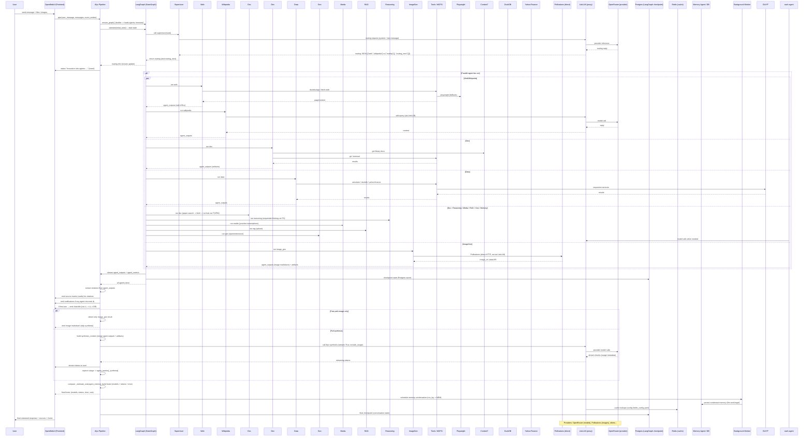

# Alyx Pipeline — Sequence Diagram

This repository implements the Alyx multi-agent pipeline. Below is a full sequence diagram (Mermaid) showing the entire stack and message flow.

---

For details about the implementation, see `sub_agents/alyx_pipeline.py`, `graph/`, and `sub_agents/agents/`.
