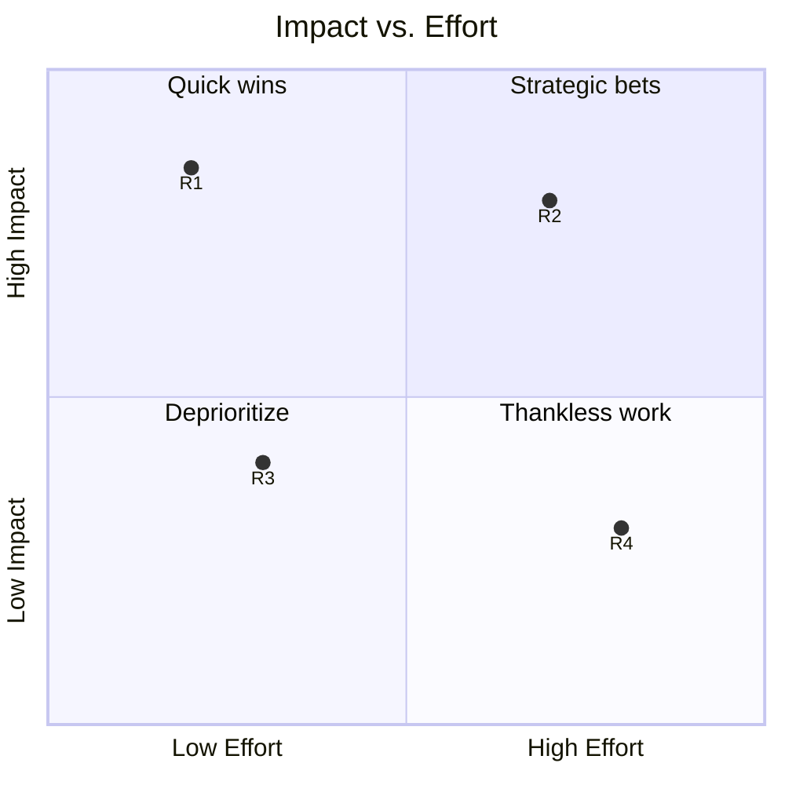

# Business Report — Corporate & Consulting Methodology

A business report is a decision-support artefact, not a narrative. It is read by busy executives who scan first and read second, so it must front-load the recommendation, justify it with auditable evidence, and end with a clear ask. This skill codifies the McKinsey / BCG / Bain "pyramid principle" applied to long-form Markdown reports of 10 to 60 pages.

---

## When to Apply

Apply this methodology when the deliverable is:

- A consulting engagement report (diagnostic, strategy, transformation, due diligence)
- A board paper or steering committee submission requiring a decision
- An internal strategy memo from a department head to the C-suite
- A quarterly or annual operational review with prioritized recommendations
- A market-entry, acquisition, or investment thesis
- A post-mortem or incident review aimed at organizational learning
- An external client-facing report tied to a paid mandate

Do NOT apply this methodology for:

- A technical architecture or engineering proposal (use `technical-rfc.md`)
- A peer-reviewed scientific publication (use `academic-paper.md`)
- A thought-leadership or lead-generation piece (use `whitepaper.md`)
- Formal minutes of a meeting (use `meeting-notes.md`)
- A one-page status email or stand-up update
- A pitch deck (the medium is slides, not prose)

---

## Document Structure

The report follows a fixed nine-block architecture. Order is non-negotiable; sections may be expanded or compressed but never reordered.

1. **Cover page metadata** — establishes provenance, confidentiality, and audience.
2. **Executive summary** — a single page that delivers the recommendation, expected impact, and required decision before the reader turns a page.
3. **Context and problem statement** — frames the business question, the trigger event, and the scope boundaries.
4. **Methodology** — discloses how the analysis was conducted so conclusions are auditable.
5. **Findings** — presents the evidence base, one finding per subsection, each anchored to data.
6. **Discussion** — synthesizes findings, weighs counter-evidence, and connects insight to strategy.
7. **Recommendations** — a prioritized action list ranked on an impact-versus-effort matrix.
8. **Conclusion** — restates the decision being requested and the immediate next step.
9. **Appendices and references** — supporting data, models, glossary, and source citations.

---

## Section-by-Section Writing Guide

### 1. Cover Page Metadata

Purpose: orient the reader before any content is read.

Include: report title, subtitle, client or sponsor name, prepared-by team, document version, classification (Public / Internal / Confidential / Restricted), date of issue, and a single-line distribution list. Avoid logos, taglines, or marketing copy.

Length: one page; no prose paragraphs.

### 2. Executive Summary

Purpose: allow a CEO who reads only this page to make the right decision.

Structure: lead with the recommendation in one sentence, follow with the three to five reasons why, quantify the expected impact, and close with the explicit ask. Use the pyramid principle: top-down, conclusion-first, supported by mutually exclusive and collectively exhaustive (MECE) arguments.

What does NOT belong: methodology details, caveats, history, definitions, or any sentence beginning with "This report".

Length: 250–400 words, strictly one page, no figures other than a single optional callout number.

### 3. Context and Problem Statement

Purpose: tell the reader why the question exists now and what is in and out of scope.

Cover: the business context, the trigger event or pain point, the question being answered (phrased as a question), the scope (geography, business unit, timeframe), explicit exclusions, and the stakeholders consulted.

Avoid: history lessons, organizational backstory unrelated to the decision, and apologetic framing.

Length: 1–2 pages.

### 4. Methodology

Purpose: make the work auditable and reproducible by a peer.

Cover: data sources (named), interview protocol (number and roles of interviewees, anonymized), analytical frameworks used (Porter, SWOT, 7S, value chain, unit economics), assumptions, and the period over which data was collected.

Avoid: tooling minutiae, software vendor names, or step-by-step procedural narrative. Stay at the level a reviewing partner can sign off on.

Length: 1–2 pages.

### 5. Findings

Purpose: present the evidence. Each finding is a discrete, defensible claim.

Format every finding as a level-3 heading stating the insight (not the topic), followed by:

- A one-sentence headline claim in bold
- 2–4 paragraphs or bullets of evidence drawn from data, interviews, benchmarks, or analysis
- At least one quantitative anchor (figure, ratio, growth rate, market size)
- A "So what" sentence that connects the finding to the business question

Findings must be MECE. Number them F1, F2, F3 for cross-reference from recommendations.

Length: 5–15 findings, 1–2 pages each.

### 6. Discussion

Purpose: synthesize findings into a coherent point of view, surface tensions, and acknowledge counter-evidence.

Cover: how the findings interact, which trade-offs the leadership team must accept, the second-order consequences, the risks if no action is taken, and the most credible objections to the emerging recommendation.

Avoid: repeating findings verbatim. The discussion is where you earn the right to make recommendations.

Length: 2–4 pages.

### 7. Recommendations

Purpose: convert insight into prioritized action.

Each recommendation is numbered R1, R2, R3 and includes: a verb-led one-line title, the rationale linking back to specific findings (F1, F3), the owner, the timeframe, the estimated cost, the expected benefit, the risks, and the success metric. Recommendations are plotted on the impact-versus-effort matrix (template below) so the reader sees the prioritization visually.

Avoid: vague verbs ("explore", "consider", "investigate"). Use commit-grade verbs ("launch", "halt", "divest", "consolidate", "hire", "renegotiate").

Length: 3–8 recommendations, ½–1 page each.

### 8. Conclusion

Purpose: restate the ask and the next 30-day step.

Cover: the recommendation in one paragraph, the decision being requested, the date by which it is needed, and the single next action if the decision is approved.

Avoid: introducing new evidence, new recommendations, or hedging language.

Length: 150–250 words.

### 9. Appendices and References

Purpose: house the supporting material that would interrupt the narrative flow.

Include: detailed data tables, financial models, interview list with dates and roles, glossary of acronyms, methodology deep-dive, source bibliography (Harvard or Chicago style), and any sensitivity analyses.

Each appendix is labelled Appendix A, B, C and referenced from the body using "(see Appendix B)".

Length: unlimited, but the body should stand alone without forcing the reader into the appendices.

---

## Output Template

```markdown
# <Report title — verb-led, decision-oriented>
## <Subtitle: the question the report answers>

| Field | Value |
|---|---|
| Prepared for | <sponsor name, role, organization> |
| Prepared by | <author team, firm or department> |
| Version | <v1.0> |
| Classification | <Public / Internal / Confidential / Restricted> |
| Date of issue | <YYYY-MM-DD> |
| Distribution | <named recipients> |

---

## Executive Summary

**Recommendation.** <One-sentence recommendation, verb-led, e.g., "Divest the EMEA logistics arm by Q4 2026 and reinvest €120M into the digital channel.">

**Why.**
- <Reason 1: anchored in a finding, with a number>
- <Reason 2: anchored in a finding, with a number>
- <Reason 3: anchored in a finding, with a number>

**Expected impact.** <Quantified outcome over a stated horizon, e.g., "+8 pts EBITDA margin by FY28, +€45M annual free cash flow.">

**Decision requested.** <Specific approval needed, by whom, by when.>

---

## 1. Context and Problem Statement

### 1.1 Business context
<2–3 paragraphs framing the market, the company, and the moment.>

### 1.2 Trigger
<Why now? What event or signal made this question urgent?>

### 1.3 Question
> <The question this report answers, phrased as a question.>

### 1.4 Scope
- **In scope**: <list>
- **Out of scope**: <list>
- **Geography**: <list>
- **Timeframe of analysis**: <YYYY–YYYY>

### 1.5 Stakeholders consulted
<Brief list of functions and seniority, anonymized if needed.>

---

## 2. Methodology

### 2.1 Approach
<Narrative of the analytical approach in 1 paragraph.>

### 2.2 Data sources
| Source | Type | Period | Use |
|---|---|---|---|
| <internal ERP extract> | <quantitative> | <YYYY-MM to YYYY-MM> | <unit economics> |
| <industry report — provider> | <secondary> | <YYYY> | <market sizing> |
| <expert interviews> | <qualitative> | <YYYY-MM> | <hypothesis testing> |

### 2.3 Frameworks applied
- <Framework 1, e.g., Porter Five Forces — used to assess industry attractiveness>
- <Framework 2, e.g., Unit economics waterfall — used to deconstruct contribution margin>

### 2.4 Key assumptions
1. <Assumption 1, with a sensitivity range>
2. <Assumption 2, with a sensitivity range>

### 2.5 Limitations
<Honest disclosure of what the analysis cannot say.>

---

## 3. Findings

### 3.1 F1 — <Insight headline as a complete sentence>
**<One-sentence claim in bold.>**

<Evidence paragraph 1, with quantitative anchor.>

<Evidence paragraph 2, with second anchor.>

*So what:* <The implication for the business question.>

### 3.2 F2 — <Insight headline>
**<Claim.>**

<Evidence.>

*So what:* <Implication.>

### 3.3 F3 — <Insight headline>
**<Claim.>**

<Evidence.>

*So what:* <Implication.>

<Continue F4, F5… as needed.>

---

## 4. Discussion

### 4.1 Synthesis
<How the findings reinforce or tension each other.>

### 4.2 Trade-offs
| Trade-off | Option A | Option B | Implication |
|---|---|---|---|
| <Speed vs. cost> | <description> | <description> | <decision criterion> |

### 4.3 Counter-evidence and objections
<Strongest objections to the emerging point of view, with rebuttals.>

### 4.4 Cost of inaction
<What happens if no decision is taken in the next 6–12 months.>

---

## 5. Recommendations

### 5.1 Prioritization — Impact × Effort



### 5.2 R1 — <Verb-led recommendation title>
| Attribute | Value |
|---|---|
| Linked findings | <F1, F3> |
| Owner | <role / name> |
| Horizon | <0–3 / 3–6 / 6–12 / 12–24 months> |
| Estimated cost | <€ / FTE> |
| Expected benefit | <€ / pts / units> |
| Key risks | <list> |
| Success metric | <KPI with target> |

<2–3 sentences of rationale.>

### 5.3 R2 — <Title>
<Same table structure.>

### 5.4 R3 — <Title>
<Same table structure.>

---

## 6. Conclusion

<Restate the recommendation in 1 paragraph. State the decision requested, by whom, by when. Name the single next action that should follow approval.>

---

## Appendices

### Appendix A — Detailed financial model
<Tables, sensitivities, scenarios.>

### Appendix B — Interview log
| # | Role | Function | Date | Duration |
|---|---|---|---|---|
| 1 | <CFO> | <Finance> | <YYYY-MM-DD> | <60 min> |

### Appendix C — Glossary
| Term | Definition |
|---|---|
| <ARR> | <Annual Recurring Revenue> |

### Appendix D — Methodology deep-dive
<Extended description of any model or framework.>

---

## References

1. <Author, A. (YYYY). *Title*. Publisher.>
2. <Organization (YYYY). *Report title*. URL. Accessed YYYY-MM-DD.>
3. <Author, B. & Author, C. (YYYY). "Article title". *Journal*, vol(issue), pp.>
```

---

## Style & Tone Guidelines

- **Voice**: third person, active. "The analysis shows" not "We believe" and not "It is believed".
- **Tense**: past for findings ("revenue declined 12%"), present for state ("the cost base is fixed"), future for recommendations ("the divestment will release €120M").
- **Person**: avoid the first person except in a signed foreword. Refer to the consulting team as "the project team" if attribution is needed.
- **Tone**: confident, precise, and neutral. Never apologetic, never breathless. Replace "we think" with "the evidence indicates".
- **Jargon**: define every acronym on first use. Prefer plain English over consulting jargon ("synergies", "low-hanging fruit", "boil the ocean" are banned).
- **Quantification**: every claim is anchored to a number, a source, or a named interview. Adjectives without numbers ("significant", "substantial", "material") are flags for revision.
- **Citation style**: Harvard (Author, Year) inline with a numbered reference list, or Chicago footnotes for client-facing reports. Pick one and apply consistently.
- **Visuals**: prefer tables over prose when comparing options. Use Mermaid diagrams for matrices and flows. Never use a chart that the body text does not interpret.
- **Length discipline**: a 30-page report read by 5 executives costs more than a 10-page report read by 50. Cut every sentence that does not change a decision.

---

## Quality Checklist

- [ ] The executive summary stands alone — a reader who reads only page 1 can act
- [ ] The recommendation appears in the first sentence of the executive summary
- [ ] Every finding has a quantitative anchor and a "so what" sentence
- [ ] Findings are MECE (mutually exclusive, collectively exhaustive)
- [ ] Recommendations are verb-led and map back to specific findings
- [ ] The impact-versus-effort matrix is populated and consistent with the recommendation order
- [ ] Counter-evidence and the cost of inaction are explicitly addressed
- [ ] Every acronym is defined on first use
- [ ] All numbers reconcile across executive summary, body, and appendices
- [ ] The conclusion names the decision, the decision-maker, and the deadline
- [ ] References use a consistent citation style and every source is verifiable

---

## Common Mistakes

- **Burying the recommendation.** If the reader has to reach page 12 to find the ask, the report has failed. Lead with the answer.
- **Confusing topic with insight.** A heading like "Pricing" is a topic; "Prices in the EMEA channel are 18% below benchmark" is an insight. Headings must be insights.
- **Adjectives instead of numbers.** "Significant decline" tells the reader nothing. "12% YoY decline over six quarters" is auditable.
- **Methodology overload.** Three pages of methodology in a ten-page report signals insecurity. Push the deep-dive to an appendix.
- **Recommendations without owners.** Unowned actions do not happen. Every R has a named role and a date.
- **Pseudo-prioritization.** Marking everything "high impact, low effort" is not a matrix. Force the spread; some recommendations belong in the deprioritize quadrant.
- **Missing counter-evidence.** A report that does not surface the strongest objection invites it to be raised in the boardroom instead.
- **Slide thinking in prose.** Bullet salads with no connective tissue read as lazy. Use full sentences for the argument and reserve bullets for parallel lists.
- **Inconsistent numbers.** Different totals in the executive summary and the appendix destroy trust. Reconcile before sending.
- **Ending with "Thank you for the opportunity".** A business report ends with the next action, not pleasantries. Move courtesies to the cover email.
