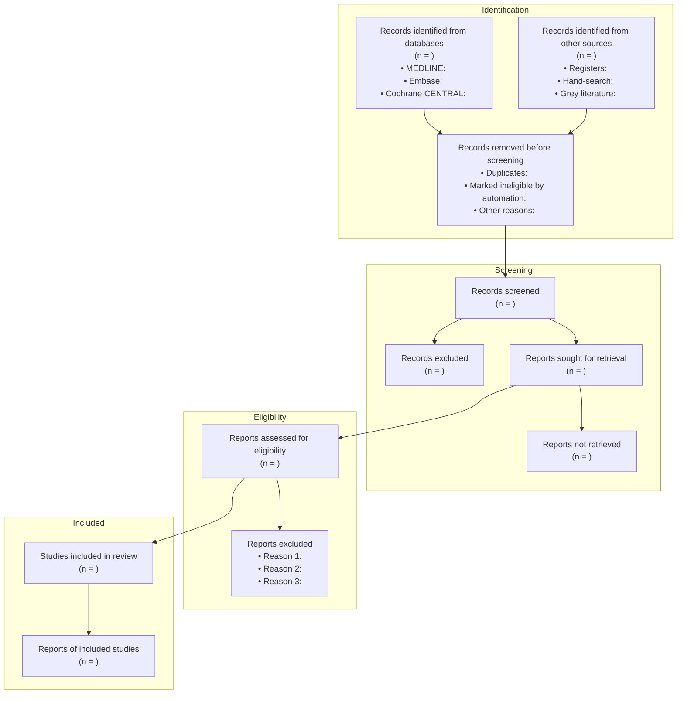

# PRISMA 2020 — Systematic Review Methodology

PRISMA 2020 is the international reporting standard for systematic reviews and meta-analyses, maintained by the EQUATOR Network. It comprises a 27-item reporting checklist and a 4-stage flow diagram that together guarantee a review is transparent, reproducible, and unbiased. Apply PRISMA whenever the user wants to synthesize a body of evidence rather than skim a few papers.

---

## When to Apply

Apply PRISMA when the request involves any of the following:

- A systematic review of a clinical, biological, epidemiological, or health-policy question
- A meta-analysis pooling effect sizes across studies
- A scoping review mapping the breadth of literature on a topic (use the PRISMA-ScR extension)
- A rapid review or umbrella review of existing systematic reviews
- An evidence synthesis intended for publication, regulatory submission, or clinical guideline development

Do NOT apply PRISMA for:

- A narrative literature overview ("tell me what's known about X") — use a thematic synthesis instead
- A single-study deep dive — use critical appraisal frameworks (CASP, JBI) directly
- A bibliometric analysis (citation networks, co-author maps) — use bibliometric methods
- An opinion piece, editorial, or commentary

---

## Methodology Overview

PRISMA rests on four pillars:

1. **A protocol registered a priori** (PROSPERO for clinical reviews, OSF for others) to prevent post-hoc cherry-picking.
2. **A reproducible search strategy** documented database-by-database with full Boolean strings, MeSH terms, filters, and dates.
3. **A two-reviewer screening process** with conflict resolution, recorded in a flow diagram.
4. **Structured reporting** of methods, results, risk of bias, certainty of evidence, and limitations against the 27-item checklist.

The methodology is descriptive of process, not prescriptive of synthesis technique: meta-analysis is optional; a narrative synthesis with PRISMA reporting is fully acceptable.

### Key definitions

- **Identification** — all records retrieved from databases, registers, and supplementary sources before deduplication.
- **Screening** — title/abstract review against eligibility criteria.
- **Eligibility** — full-text review of records passing screening.
- **Included** — records contributing to the synthesis.
- **PICO** — Population, Intervention, Comparator, Outcome (the canonical question framework).
- **Risk of bias (RoB)** — study-level appraisal using tools such as RoB 2 (RCTs), ROBINS-I (non-randomized studies), QUADAS-2 (diagnostic accuracy), or AMSTAR-2 (umbrella reviews).

---

## Step-by-Step Application

1. **Frame the question with PICO (or PICOS, PECO, PCC for scoping).**
   - State Population, Intervention, Comparator, Outcome, Study design explicitly.
   - From PICO derive both inclusion and exclusion criteria before any searching begins.

2. **Register the protocol.**
   - Remind the user to register with PROSPERO (clinical/health) or OSF Registries (other domains) before screening starts.
   - Record the registration ID in the final report.

3. **Construct the search strategy.**
   - Select at least three databases (e.g., MEDLINE/PubMed, Embase, Cochrane CENTRAL, Scopus, Web of Science, CINAHL, PsycINFO).
   - For each database, build a Boolean string combining MeSH/Emtree controlled vocabulary with free-text synonyms.
   - Document filters (language, date range, study type) and the exact date the search was run.
   - Supplement with hand-searching of references, grey literature (OpenGrey, ClinicalTrials.gov, WHO ICTRP), and forward citation tracking.

4. **Deduplicate and screen.**
   - Import all records into a reference manager (Zotero, EndNote) or systematic-review platform (Covidence, Rayyan, DistillerSR).
   - Two independent reviewers screen titles/abstracts; a third resolves conflicts.
   - Repeat at full-text stage and record the reason for every exclusion.

5. **Extract data.**
   - Use a piloted extraction form covering study characteristics, participants, intervention details, outcomes, effect sizes, and funding sources.
   - Two reviewers extract independently; arbitrate disagreements.

6. **Assess risk of bias.**
   - Select the appropriate tool per study design (RoB 2, ROBINS-I, QUADAS-2, Newcastle-Ottawa).
   - Two reviewers rate each domain; resolve disagreements.

7. **Synthesize.**
   - If quantitative pooling is appropriate (clinical and methodological homogeneity), perform meta-analysis with heterogeneity statistics (I², τ², 95% prediction interval) and sensitivity analyses.
   - Otherwise, conduct a structured narrative synthesis (SWiM guidance).

8. **Rate certainty of evidence.**
   - Delegate to the GRADE methodology (skills/grade.md) for each outcome.

9. **Report against the 27-item checklist.**
   - Render the flow diagram (see template below).
   - Complete the checklist as a supplementary table indicating where each item is reported.

---

## The 27-Item PRISMA 2020 Checklist

| # | Section / Topic | Item |
|---|---|---|
| 1 | Title | Identify the report as a systematic review |
| 2 | Abstract | Provide a structured abstract following PRISMA for Abstracts |
| 3 | Introduction — Rationale | Describe rationale in context of existing knowledge |
| 4 | Introduction — Objectives | Provide explicit PICO objectives |
| 5 | Methods — Eligibility criteria | State inclusion/exclusion criteria and grouping |
| 6 | Methods — Information sources | List all databases, registers, websites, organizations, dates |
| 7 | Methods — Search strategy | Present full search strategies for all sources |
| 8 | Methods — Selection process | Describe screening methods, reviewer count, automation tools |
| 9 | Methods — Data collection | Describe extraction methods, reviewer count, automation tools |
| 10a | Methods — Data items (outcomes) | List all outcomes for which data were sought |
| 10b | Methods — Data items (other) | List all other variables collected |
| 11 | Methods — Risk of bias | Specify methods used to assess RoB |
| 12 | Methods — Effect measures | Specify the effect measure(s) used (e.g., RR, MD) |
| 13a-f | Methods — Synthesis methods | Describe eligibility for synthesis, preparation, tabulation, statistical methods, heterogeneity, sensitivity analyses |
| 14 | Methods — Reporting bias | Describe methods to assess risk of bias due to missing results |
| 15 | Methods — Certainty assessment | Describe methods used to assess certainty (GRADE) |
| 16a-b | Results — Study selection | Report numbers screened, included, excluded; provide flow diagram |
| 17 | Results — Study characteristics | Cite each included study and present characteristics |
| 18 | Results — Risk of bias in studies | Present RoB assessments |
| 19 | Results — Results of individual studies | Present summary statistics and effect estimates with CIs |
| 20a-d | Results — Results of syntheses | Briefly summarize characteristics, present each synthesis with CIs and heterogeneity, investigate causes of heterogeneity, present sensitivity analyses |
| 21 | Results — Reporting biases | Present assessments of reporting bias |
| 22 | Results — Certainty of evidence | Present certainty (GRADE) for each outcome |
| 23a-d | Discussion | Interpret results in context of evidence, discuss limitations of evidence and of the review process, implications for practice/policy/research |
| 24a-c | Other — Registration & protocol | Provide registration details and protocol access |
| 25 | Other — Support | Describe sources of financial/non-financial support |
| 26 | Other — Competing interests | Declare competing interests |
| 27 | Other — Availability of data | State availability of data, code, materials |

---

## Output Template

### 1. Flow Diagram (Mermaid)

### 2. Eligibility Criteria

| Domain | Inclusion | Exclusion |
|---|---|---|
| Population | <insert population, age range, condition> | <insert excluded subgroups> |
| Intervention | <insert intervention, dose, duration> | <insert excluded interventions> |
| Comparator | <insert comparator(s)> | <insert excluded comparators> |
| Outcome | <insert primary and secondary outcomes> | <studies not reporting these outcomes> |
| Study design | <RCT / cohort / case-control / qualitative / mixed> | <case reports, editorials, conference abstracts> |
| Language | <e.g., English, French, no restriction> | <other languages> |
| Date range | <insert YYYY–YYYY> | <records outside range> |
| Setting | <insert setting> | <excluded settings> |

### 3. Search Strategy Template

| Database | Platform | Date searched | Search string | Filters | Records |
|---|---|---|---|---|---|
| MEDLINE | PubMed | <YYYY-MM-DD> | `("MeSH term 1"[MeSH] OR "synonym 1"[tiab] OR "synonym 2"[tiab]) AND ("MeSH term 2"[MeSH] OR "synonym 3"[tiab]) AND ("randomized"[tiab] OR "trial"[tiab])` | English, Humans, 2010– | <n> |
| Embase | Ovid | <YYYY-MM-DD> | `(exp Concept1/ OR synonym1.tw.) AND (exp Concept2/ OR synonym2.tw.) AND (randomized controlled trial.pt.)` | English | <n> |
| Cochrane CENTRAL | Wiley | <YYYY-MM-DD> | `(concept1 OR synonym1) AND (concept2 OR synonym2)` | Trials only | <n> |
| <other> | <platform> | <YYYY-MM-DD> | `<string>` | <filters> | <n> |

Boolean construction rules:

- Combine concept blocks with `AND`.
- Within each block, combine synonyms with `OR`.
- Use controlled vocabulary (MeSH, Emtree) AND free text with `.tw.` / `[tiab]` to maximize sensitivity.
- Use truncation (`*`, `$`) and proximity operators (`adj3`, `NEAR/3`) per platform syntax.
- Document every filter (date, language, study type, age, species).

### 4. Risk-of-Bias Prompts

For each included study, the agent prompts the reviewer to rate:

- **RoB 2 (RCTs)**: randomization process, deviations from intended interventions, missing outcome data, measurement of the outcome, selection of the reported result. Overall judgment: low / some concerns / high.
- **ROBINS-I (non-randomized)**: confounding, selection of participants, classification of interventions, deviations, missing data, measurement of outcomes, selection of reported result. Overall: low / moderate / serious / critical / no information.
- **QUADAS-2 (diagnostic)**: patient selection, index test, reference standard, flow and timing. Risk of bias + applicability concerns per domain.
- **Newcastle-Ottawa (observational)**: selection, comparability, outcome/exposure. Star rating 0–9.

### 5. Summary of Included Studies

| Study (Author, Year) | Design | N | Population | Intervention | Comparator | Primary outcome | Effect estimate (95% CI) | RoB |
|---|---|---|---|---|---|---|---|---|
| <Author YYYY> | <RCT> | <n> | <population> | <intervention> | <comparator> | <outcome> | <estimate (CI)> | <low/some/high> |

### 6. PROSPERO Registration Reminder

Insert verbatim in the report:

> This review was prospectively registered on PROSPERO (registration ID: `<CRD42024XXXXXX>`) on `<YYYY-MM-DD>`. The protocol is publicly available at `https://www.crd.york.ac.uk/prospero/display_record.php?ID=<ID>`.

If the user has not registered, prompt them to do so before screening begins. Post-hoc registration is permitted only with full disclosure of timing.

---

## Quality Checklist

- [ ] PICO/PICOS is explicit and unambiguous
- [ ] Protocol registered prospectively (PROSPERO ID present)
- [ ] At least three databases searched with full Boolean strings reported
- [ ] Search date and language/date filters disclosed
- [ ] Two reviewers screened independently with conflict resolution method stated
- [ ] Flow diagram numbers reconcile (identified = screened + duplicates removed; screened = excluded + retrieved; etc.)
- [ ] Every full-text exclusion has a recorded reason
- [ ] Risk of bias assessed with a design-appropriate tool
- [ ] Heterogeneity quantified (I², τ²) if meta-analysis performed
- [ ] Certainty of evidence rated per outcome via GRADE
- [ ] All 27 PRISMA items mapped in a supplementary checklist
- [ ] Funding and competing interests declared

---

## Common Mistakes

- **Retrofitting a protocol.** Writing a protocol after screening defeats the purpose; date-stamp every protocol revision.
- **Searching only PubMed.** Single-database searches miss 20–40% of eligible records; always triangulate.
- **Skipping grey literature.** Publication bias is real; include trial registers and dissertations.
- **One reviewer screening.** Single-reviewer screening doubles the false-exclusion rate; insist on two.
- **Vague exclusion reasons.** "Not relevant" is not a reason. Use predefined codes (wrong population, wrong intervention, wrong outcome, wrong design, duplicate report).
- **Pooling clinically heterogeneous studies.** A statistically possible meta-analysis is not always meaningful; check for clinical and methodological homogeneity first.
- **Reporting only the pooled effect.** Always present individual study estimates, heterogeneity, and prediction interval.
- **Omitting risk of bias from interpretation.** A pooled estimate dominated by high-RoB studies must be flagged.
- **Confusing PRISMA with GRADE.** PRISMA governs the review process; GRADE rates the evidence. Apply both.
- **Treating PRISMA as a quality tool.** PRISMA is a reporting standard. A poorly conducted review can still be PRISMA-compliant on paper. Combine with AMSTAR-2 for methodological quality appraisal.
