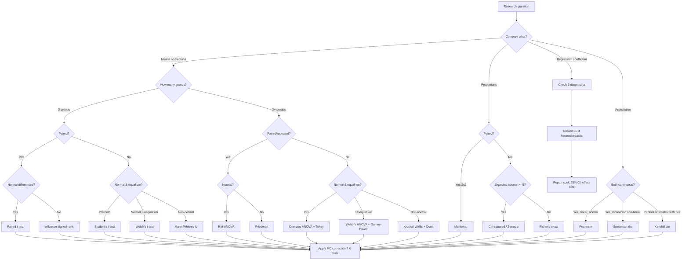

# Statistical Tests — Decision Tree and Methodology

Choosing the right statistical test is a function of four inputs: **what you are comparing** (means, proportions, distributions, associations), **the data type** (continuous, ordinal, categorical), **the sample size**, and **whether observations are paired**. This skill gives the `data` agent a prescriptive decision tree, the assumptions behind each test, and the effect size that must accompany every p-value.

---

## When to Apply

Apply this skill when the user asks for:

- Significance testing of two or more groups
- A/B or experiment readout
- Correlation strength and significance
- Whether a difference is "real" vs noise
- Regression coefficient validity
- Adjustment for multiple comparisons
- Selection between parametric and non-parametric methods

Skip this skill when the request is purely descriptive ("show me the mean by group"), when the user wants ML model selection, or when the question requires causal inference machinery (DAGs, IV, regression discontinuity).

---

## Core Principles

1. **State the null hypothesis explicitly.** Every test rejects (or fails to reject) a specific null. Write it down.
2. **Report effect size alongside p-value.** A p-value answers "is there an effect?", an effect size answers "how big?". Both are required.
3. **Check assumptions before the test.** Parametric tests assume specific distributions; violating them invalidates the p-value, not just its precision.
4. **Pre-specify alpha.** Standard is 0.05, but justify the choice and adjust for multiple comparisons.
5. **Power and sample size matter more than p-values.** A non-significant result in N=20 is uninformative; a significant result in N=10,000,000 may be trivial.

---

## Section 1 — Comparison of Means

### Student's t-test (two-sample, equal variance)

- **Null:** Means of two independent populations are equal.
- **Use when:** Both groups are roughly normal AND variances are equal (Levene's test p > 0.05).
- **Avoid when:** Skewed distributions, heavy tails, or unequal variance.
- **Sample size:** N ≥ 30 per group makes normality less critical (CLT). For N < 30, normality must hold.
- **Effect size:** Cohen's d (0.2 small, 0.5 medium, 0.8 large).

### Welch's t-test (two-sample, unequal variance)

- **Null:** Means of two independent populations are equal.
- **Use when:** Variances differ OR sample sizes differ substantially. **This is the safer default** over Student's t-test.
- **Avoid when:** Severely non-normal small samples (N < 30).
- **Effect size:** Cohen's d with pooled SD.

### Paired t-test

- **Null:** Mean difference within pairs is zero.
- **Use when:** Same subjects measured twice (before/after), matched pairs, or repeated measures with two timepoints.
- **Avoid when:** Differences are heavily skewed → use Wilcoxon signed-rank.
- **Effect size:** Cohen's d_z (mean diff / SD of differences).

### Mann-Whitney U (Wilcoxon rank-sum)

- **Null:** Distributions of two independent groups have equal medians (strictly: equal probability of being larger).
- **Use when:** Continuous or ordinal data, non-normal, two independent groups.
- **Avoid when:** Distributions have very different shapes — the test conflates location and shape differences.
- **Sample size:** Works for any N ≥ 5 per group, but power is low for small samples.
- **Effect size:** Rank-biserial correlation, or report median difference + Hodges-Lehmann estimator.

### Wilcoxon signed-rank

- **Null:** Median of paired differences is zero.
- **Use when:** Paired non-normal data.
- **Avoid when:** Many ties in differences (use sign test instead).
- **Effect size:** Matched-pairs rank-biserial correlation.

---

## Section 2 — Comparison of Proportions

### Two-proportion z-test

- **Null:** Two population proportions are equal.
- **Use when:** Both np and n(1-p) ≥ 10 in each group.
- **Avoid when:** Either cell expected count < 5.
- **Effect size:** Absolute risk difference, relative risk, or odds ratio with 95% CI.

### Chi-squared test of independence

- **Null:** Row and column variables are independent.
- **Use when:** Contingency table with all expected counts ≥ 5.
- **Avoid when:** Any expected count < 5 (use Fisher's exact), or paired data (use McNemar).
- **Effect size:** Cramér's V, or odds ratio for 2×2.

### Fisher's exact test

- **Null:** No association between row and column variables.
- **Use when:** Small samples, sparse cells, or expected counts < 5 in any cell of a 2×2 table.
- **Avoid when:** Very large tables — computationally expensive and rarely needed (chi-squared is fine).
- **Effect size:** Odds ratio.

### McNemar's test

- **Null:** Marginal probabilities are equal in a paired 2×2 (e.g., before/after binary outcome).
- **Use when:** Paired binary data, e.g., same subjects classified before and after intervention.
- **Avoid when:** Independent groups (use chi-squared).
- **Effect size:** Difference in proportions of discordant pairs.

---

## Section 3 — Three or More Groups

### One-way ANOVA

- **Null:** All group means are equal.
- **Use when:** ≥ 3 independent groups, roughly normal within each group, equal variances (Levene's p > 0.05).
- **Avoid when:** Strongly skewed data or unequal variances — use Welch's ANOVA or Kruskal-Wallis.
- **Sample size:** N ≥ 20 per group recommended.
- **Effect size:** Eta-squared (η²) or omega-squared (ω²).
- **Follow-up:** Pairwise comparisons with Tukey HSD (controls family-wise error).

### Welch's ANOVA

- **Null:** Same as one-way ANOVA.
- **Use when:** Group variances differ. Safer default than classical ANOVA.
- **Follow-up:** Games-Howell post-hoc.

### Kruskal-Wallis

- **Null:** Distributions of ≥ 3 independent groups have equal medians.
- **Use when:** Non-normal data, ordinal data, or strongly heteroskedastic continuous data.
- **Effect size:** Epsilon-squared (ε²).
- **Follow-up:** Dunn's test with Bonferroni or Holm correction.

### Repeated-measures ANOVA / Friedman

- **Null:** Mean (or median) is equal across ≥ 3 timepoints on the same subjects.
- **Use when:** Same subjects measured at ≥ 3 timepoints (RM-ANOVA for normal, Friedman for non-normal).
- **Assumption:** Sphericity for RM-ANOVA (Mauchly's test); use Greenhouse-Geisser correction if violated.

---

## Section 4 — Correlations

### Pearson's r

- **Null:** Linear correlation coefficient is zero.
- **Use when:** Both variables continuous, roughly normal, linear relationship.
- **Avoid when:** Outliers, non-linear monotonic relationships, ordinal data.
- **Effect size:** r itself (0.1 small, 0.3 medium, 0.5 large).
- **Report:** r, 95% CI via Fisher z-transform, N.

### Spearman's rho

- **Null:** No monotonic association.
- **Use when:** Non-linear monotonic relationship, ordinal data, presence of outliers.
- **Effect size:** rho itself, interpreted like r.

### Kendall's tau

- **Null:** No monotonic association.
- **Use when:** Small samples, many ties, or when a more conservative estimate than Spearman is wanted.
- **Effect size:** tau (interpreted differently from r — values tend to be smaller; tau = 0.3 is comparable to rho ≈ 0.4).

### When to choose which

- Continuous, linear, normal → **Pearson**
- Monotonic but non-linear OR ordinal → **Spearman**
- Small sample (N < 30) with ties → **Kendall**

---

## Section 5 — Regression Diagnostics

Before reporting a regression coefficient as "significant", verify:

1. **Linearity** — residuals vs fitted plot shows no pattern.
2. **Independence** — Durbin-Watson ≈ 2 for time series; no clustered residuals.
3. **Homoscedasticity** — Breusch-Pagan test p > 0.05, or use heteroskedasticity-robust standard errors (HC3).
4. **Normality of residuals** — Q-Q plot of residuals; matters mainly for small samples and CI precision.
5. **No multicollinearity** — VIF < 5 (strict) or < 10 (lax) for every predictor.
6. **No high-leverage outliers** — Cook's distance < 1, hat values < 2p/n.

If assumptions fail:
- Heteroskedasticity → robust SEs (HC3) or weighted least squares.
- Non-linearity → transform predictor or add polynomial / spline terms.
- Outliers → robust regression (Huber, RANSAC) or remove with justification.
- Multicollinearity → drop redundant predictors, or use ridge regression.

Report regression results as: coefficient, robust SE, 95% CI, p-value, and a goodness-of-fit metric (adjusted R² for linear, AUC / Brier for logistic).

---

## Section 6 — Multiple Comparisons Correction

Running K independent tests at alpha = 0.05 inflates the family-wise error rate to roughly 1 - (1-0.05)^K.

### Bonferroni

- **Method:** Reject if p < alpha / K.
- **Use when:** Small K (≤ 10), strong family-wise error control needed.
- **Drawback:** Very conservative; loses power as K grows.

### Holm-Bonferroni

- **Method:** Sort p-values ascending; compare p(i) to alpha / (K - i + 1).
- **Use when:** Want Bonferroni-level FWER control with more power.
- **Default for FWER**.

### Benjamini-Hochberg (BH / FDR)

- **Method:** Sort p-values; find largest i such that p(i) ≤ (i / K) × alpha; reject all up to i.
- **Use when:** Exploratory analysis, large K (genomics, A/B test screens), where a controlled fraction of false discoveries (FDR) is acceptable.
- **Default for FDR**.

### Choice rule

- Confirmatory research with K small → **Holm-Bonferroni**.
- Exploratory or screening with K large → **Benjamini-Hochberg**.
- Pre-registered single primary hypothesis → **no correction** beyond the primary test.

---

## Decision Tree



---

## Output Template

```
## Hypothesis
- Null (H0): <state precisely>
- Alternative (H1): <one-sided or two-sided>
- Alpha: 0.05 (or justified value)

## Data
- Variable type: <continuous / ordinal / categorical>
- Sample sizes: <n1 = ..., n2 = ...>
- Paired: <yes/no>

## Assumption checks
- Normality: <Shapiro-Wilk p = ..., or visual Q-Q>
- Equal variance: <Levene p = ...>
- Other: <independence, expected counts, etc.>

## Test selected
- <Test name>, reason: <which assumptions justify it>

## Result
- Test statistic: <value>
- p-value: <value>
- 95% CI of effect: <lower, upper>
- Effect size: <Cohen's d / Cramér's V / r / etc.> = <value> (<small/medium/large>)

## Multiple comparisons
- K tests in family: <number>
- Correction: <none / Holm / BH>
- Adjusted p-value: <value>

## Interpretation
- One sentence on practical significance, not just statistical.
- One sentence on power or sample-size limitations.
```

---

## Quality Checklist

- [ ] Null hypothesis stated in plain language
- [ ] Assumptions checked and reported, not assumed
- [ ] Welch's t-test used instead of Student's by default
- [ ] Effect size reported alongside p-value with interpretation
- [ ] Confidence interval reported for the effect
- [ ] Multiple comparisons correction applied if K > 1
- [ ] Sample size adequacy commented on
- [ ] Practical significance distinguished from statistical significance
- [ ] Two-sided test used unless one-sided is pre-justified

---

## Common Mistakes

**Reporting p without effect size.** A p-value tells you nothing about magnitude. Always report Cohen's d, Cramér's V, r, or risk difference.

**Using Student's t when variances differ.** Welch's t-test is robust and should be the default. Student's t requires Levene's test confirmation of equal variance.

**Chi-squared on sparse tables.** Any expected cell count < 5 invalidates the chi-squared approximation. Switch to Fisher's exact.

**Forgetting paired structure.** Treating paired data as independent (e.g., before/after measurements as two independent samples) inflates standard error and hides effects. Use paired t-test, Wilcoxon signed-rank, or McNemar.

**P-hacking via multiple tests.** Running 20 tests and reporting the one with p < 0.05 has expected one false positive by chance. Pre-specify the primary test or apply BH correction.

**Treating non-significant as "no effect".** Absence of evidence is not evidence of absence. Report the confidence interval — a wide CI around zero means "underpowered", not "no effect".

**Pearson on non-linear data.** Pearson's r captures only linear association. Use Spearman or visualize first.

**ANOVA without post-hoc.** A significant ANOVA tells you "at least one pair differs" — not which. Always follow with Tukey HSD, Games-Howell, or Dunn's test.

**Ignoring regression diagnostics.** A coefficient is only as trustworthy as its assumptions. Always report robust SEs or run the six diagnostics.

**Massive N, tiny effect.** With N = 1,000,000, almost any difference is "significant". Report effect size and ask whether it crosses a domain-meaningful threshold.
