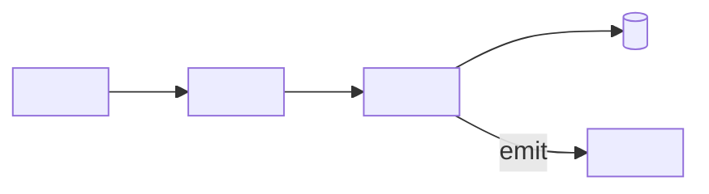
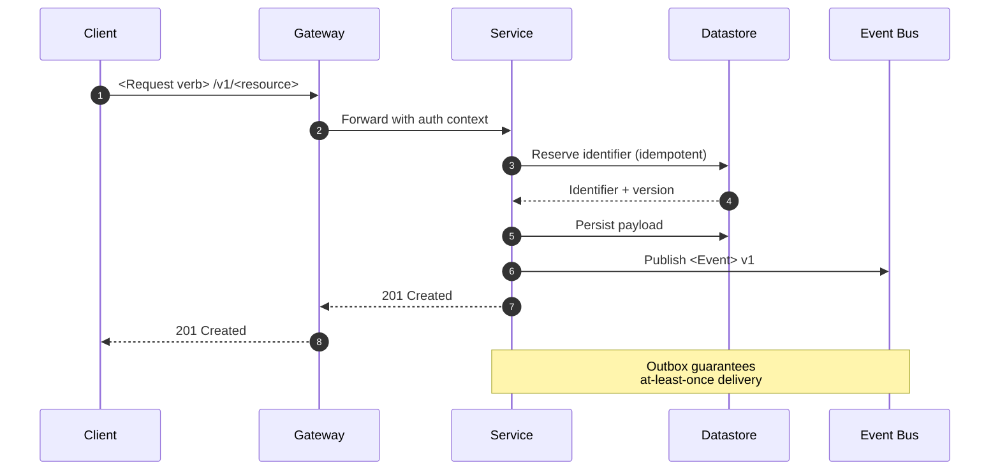

# Technical RFC — Engineering Design Document Methodology

A Request for Comments is the engineering equivalent of a contract: it specifies what will be built, why, and under what constraints, and it invites peers to challenge the design before code is written. This skill codifies the IETF RFC tradition adapted for internal engineering organizations (Google, Cloudflare, Rust language team, Python PEP, Squarespace, Stripe). An RFC is not a tutorial, not a postmortem, and not a marketing piece — it is a normative specification under review.

---

## When to Apply

Apply this methodology when the change being proposed is:

- A new system, service, or major subsystem (databases, message brokers, APIs)
- A breaking change to a public or internal interface (schemas, protocols, SDKs)
- A cross-team migration, deprecation, or architectural inflection
- A new security, identity, or data-handling model
- A significant build-versus-buy or vendor selection
- A protocol, file format, or wire format change
- Any change that touches more than one team and cannot be reversed cheaply

Do NOT apply this methodology for:

- A single-team refactor that fits in a pull-request description
- A lightweight architecture decision record — use MADR (Markdown ADR) which is 1 page
- A product requirement document — that is product management, not engineering
- A postmortem or incident review — use the org's incident template
- A user-facing tutorial or how-to — use documentation patterns
- A research exploration with no commitment to ship

---

## Document Structure

The RFC is composed of thirteen blocks. Order is fixed by convention so reviewers can navigate any RFC the same way.

1. **Header** — title, RFC number, status, authors, dates, target reviewers.
2. **Abstract** — a paragraph that summarizes the problem and the proposed solution.
3. **Motivation** — why this change is necessary; what hurts today.
4. **Proposed design** — the normative core of the document.
5. **Alternatives considered** — what was rejected and why.
6. **Trade-offs** — the costs of the chosen design, stated honestly.
7. **Migration plan** — how the world moves from before to after.
8. **Security and privacy considerations** — threat model and data handling.
9. **Observability** — how the system will be measured and debugged in production.
10. **Rollout** — the operational sequence to ship safely.
11. **Open questions** — explicit unresolved issues seeking reviewer input.
12. **References** — prior art, related RFCs, standards, papers.
13. **Appendices** — supporting material, benchmarks, glossary.

---

## Section-by-Section Writing Guide

### 1. Header

Purpose: make the metadata indexable and unambiguous.

Include: RFC identifier (RFC-NNNN), title, status (Draft, In Review, Accepted, Rejected, Withdrawn, Superseded), authors with email handles, shepherd or sponsor, creation date, last-modified date, target review date, and a link to the discussion thread. Status is a single token, not a phrase.

Length: a metadata table, no prose.

### 2. Abstract

Purpose: let a reader decide in 60 seconds whether the RFC concerns them.

Cover: the problem in one sentence, the proposed solution in one sentence, the affected systems in one sentence, the call to action in one sentence (review by date, decision by date).

Avoid: motivation, history, or design detail. Keep it tight.

Length: 100–200 words.

### 3. Motivation

Purpose: justify why doing nothing is worse than the cost of this change.

Cover: the user or operator pain in concrete terms, the volume of the pain (frequency, severity, cost), the relevant prior attempts and why they fell short, and the strategic context. Use real incidents, real metrics, real quotes from operators or customers where possible.

Avoid: speculative future needs ("we might want to…"), and arguments from authority ("the CTO asked us to…"). The motivation must be defensible to a skeptical peer.

Length: 1–3 pages.

### 4. Proposed Design

Purpose: specify the change with enough precision that two independent teams could implement it the same way.

Cover: the high-level architecture (diagram), the data model, the API or wire-format changes, the components and their responsibilities, the failure modes and how they are handled, the dependencies, and the invariants the design maintains. Use normative language (MUST, SHOULD, MAY) following RFC 2119 conventions where applicable.

Sub-sections to use as needed:
- Architecture overview (with a diagram)
- Data model (schemas, types, cardinalities)
- API surface (endpoints, methods, contracts)
- Sequence diagrams for critical flows
- Failure modes and recovery
- Dependencies and assumptions

Avoid: implementation minutiae that belong in code review. Avoid pseudocode unless it disambiguates a contract.

Length: the largest section, typically 40–60% of the RFC.

### 5. Alternatives Considered

Purpose: prove the chosen design is the best of the realistic options.

For each alternative, document: a one-paragraph description, the reasons it was rejected, the conditions under which it would be revisited. Include the "do nothing" option as a baseline.

Avoid: strawman alternatives obviously inferior to the chosen design. Reviewers see through them and lose trust.

Length: 2–5 alternatives, ½–1 page each.

### 6. Trade-offs

Purpose: state the costs of the chosen design before reviewers discover them.

Cover: latency, cost, complexity, operational burden, vendor lock-in, blast radius, reversibility. Frame each trade-off as "we accept X in order to gain Y".

Length: ½–1 page.

### 7. Migration Plan

Purpose: describe how the system moves from current state to target state without breaking users.

Cover: prerequisite work, the phased sequence (alpha, beta, GA), backward compatibility windows, deprecation timelines, dual-write or shadow-traffic strategies, rollback path. Quantify each phase with a duration and an exit criterion.

Length: 1–2 pages.

### 8. Security and Privacy Considerations

Purpose: surface threats and data-handling implications before they become incidents.

Cover: the threat model (who is the adversary, what can they do), the authentication and authorization model, encryption at rest and in transit, secret management, the data classification of every new field, retention and deletion, regulatory implications (GDPR, HIPAA, PCI, SOC 2), audit logging.

Even if the RFC has minimal security impact, state so explicitly with a one-line justification. Silence is not acceptable.

Length: ½–2 pages.

### 9. Observability

Purpose: ensure the system can be operated and debugged in production from day one.

Cover: the metrics that will be emitted (with names and units), the logs and their structure, the traces and their span names, the dashboards that will be built, the alerts and their thresholds, the SLOs and error budgets.

Length: ½–1 page.

### 10. Rollout

Purpose: define the operational sequence and the safety net.

Cover: feature flags, percentage rollout schedule, canary cohorts, success criteria per stage, monitoring during rollout, the rollback procedure with an estimated MTTR, the communication plan to stakeholders.

Length: ½–1 page.

### 11. Open Questions

Purpose: invite reviewer input on issues the authors could not resolve.

List each as a numbered question with a brief context. Distinguish "must resolve before acceptance" from "can resolve post-acceptance".

Length: 5–15 questions.

### 12. References

Purpose: ground the RFC in prior art so reviewers can trace lineage.

Include: related internal RFCs, IETF or W3C standards, academic papers, vendor documentation, blog posts (only when substantive).

### 13. Appendices

Purpose: house benchmarks, capacity calculations, prototype results, and glossary.

---

## Output Template

```markdown
# RFC-<NNNN>: <Title — noun phrase, e.g., "Sharded Write Path for Order Events">

| Field | Value |
|---|---|
| Status | <Draft / In Review / Accepted / Rejected / Withdrawn / Superseded> |
| Authors | <name1@org>, <name2@org> |
| Shepherd | <reviewer-of-record@org> |
| Created | <YYYY-MM-DD> |
| Last updated | <YYYY-MM-DD> |
| Target review by | <YYYY-MM-DD> |
| Discussion | <link to PR or thread> |
| Supersedes | <RFC-NNNN or "none"> |
| Superseded by | <RFC-NNNN or "none"> |

---

## Abstract

<100–200 words: the problem, the proposed solution, the affected systems, the decision being sought.>

---

## 1. Motivation

### 1.1 Current state
<What exists today. Be concrete: name services, name teams, name metrics.>

### 1.2 The pain
<What hurts. Quote operators, cite incidents by ID, give frequencies and costs.>

| Symptom | Frequency | Impact | Evidence |
|---|---|---|---|
| <e.g., write-amplification on hot partitions> | <N/day> | <p99 latency +400ms> | <incident INC-1234> |

### 1.3 Prior attempts
<What was tried, why it did not work, what was learned.>

### 1.4 Goals and non-goals
- **Goals**:
  - <Goal 1, measurable>
  - <Goal 2, measurable>
- **Non-goals**:
  - <Explicit out-of-scope item 1>
  - <Explicit out-of-scope item 2>

---

## 2. Proposed Design

### 2.1 Overview
<2–3 paragraph narrative of the proposed system.>

### 2.2 Architecture



### 2.3 Data model
| Entity | Field | Type | Cardinality | Notes |
|---|---|---|---|---|
| <Order> | <id> | <UUIDv7> | <1> | <primary key, time-ordered> |
| <Order> | <tenant_id> | <UUID> | <1> | <foreign key, indexed> |

### 2.4 API surface
| Method | Path | Request | Response | Idempotency |
|---|---|---|---|---|
| `POST` | `/v1/<resource>` | <schema ref> | <schema ref> | <key header required> |
| `GET` | `/v1/<resource>/{id}` | — | <schema ref> | <N/A> |

### 2.5 Critical sequence



### 2.6 Failure modes
| Failure | Detection | Behavior | Recovery |
|---|---|---|---|
| <Datastore unavailable> | <healthcheck timeout> | <write rejected with 503> | <client retry with backoff> |
| <Event bus unavailable> | <publish error> | <write committed, outbox flushes later> | <background reconciler> |

### 2.7 Invariants
- INV-1: <e.g., "every persisted order MUST have at most one corresponding event on the bus">
- INV-2: <e.g., "tenant isolation MUST hold across all read and write paths">

### 2.8 Normative requirements (RFC 2119)
- The service MUST validate the `Idempotency-Key` header on all POST requests.
- The service SHOULD return `429` when per-tenant QPS exceeds the configured limit.
- The service MAY batch outbox flushes up to 100ms.

---

## 3. Alternatives Considered

### 3.1 Alternative A — <Name>
<Description. Why rejected. Conditions for revisiting.>

### 3.2 Alternative B — <Name>
<Description. Why rejected.>

### 3.3 Alternative C — Do nothing
<What happens if no change is made; quantify the cost of inaction.>

---

## 4. Trade-offs

| Accept | In exchange for | Quantification |
|---|---|---|
| <additional operational complexity> | <horizontal scalability> | <ops cost +X engineer-hours/month> |
| <eventual consistency between store and bus> | <write-path latency reduced by Y ms> | <reconciliation lag p99 ≤ Z seconds> |

---

## 5. Migration Plan

| Phase | Duration | Scope | Exit criterion | Rollback |
|---|---|---|---|---|
| 0 — Foundations | <2 weeks> | <infra, IAM, schemas> | <terraform applied in all envs> | <terraform destroy> |
| 1 — Dual-write shadow | <3 weeks> | <new path receives shadow traffic> | <parity report ≥ 99.9% over 7 days> | <disable shadow flag> |
| 2 — Canary | <2 weeks> | <1% real traffic> | <no SLO regression for 14 days> | <flag flip to 0%> |
| 3 — Ramp | <4 weeks> | <10% → 50% → 100%> | <100% sustained 14 days> | <flag flip per cohort> |
| 4 — Decommission | <4 weeks> | <legacy path read-only, then deleted> | <zero references in 30 days of logs> | <restore from snapshot> |

Backward compatibility window: <e.g., "legacy `v0` API remains operational for 6 months after GA">.

---

## 6. Security and Privacy Considerations

### 6.1 Threat model
- **Adversary**: <external attacker / malicious tenant / compromised insider>
- **Assets**: <list of sensitive data classes>
- **Attack surfaces**: <list>

### 6.2 Controls
| Control | Mechanism |
|---|---|
| Authentication | <e.g., mTLS between services, OIDC for clients> |
| Authorization | <e.g., per-tenant RBAC enforced at gateway and service> |
| Encryption in transit | <TLS 1.3 minimum> |
| Encryption at rest | <KMS-backed, per-tenant DEK> |
| Secret management | <vault path, rotation policy> |
| Audit logging | <event names, retention> |

### 6.3 Data classification
| Field | Classification | Retention | Right-to-erasure path |
|---|---|---|---|
| <field> | <PII / confidential / public> | <N days> | <tombstone + cascade> |

### 6.4 Regulatory implications
<GDPR, HIPAA, PCI, SOC 2 — state each one's applicability with one line.>

---

## 7. Observability

### 7.1 Metrics
| Metric | Type | Unit | Labels |
|---|---|---|---|
| `<service>_requests_total` | counter | requests | method, route, status, tenant |
| `<service>_request_duration_seconds` | histogram | seconds | method, route |
| `<service>_outbox_lag_seconds` | gauge | seconds | shard |

### 7.2 Logs
<Structured JSON; required fields: trace_id, span_id, tenant_id, request_id, route, status, duration_ms.>

### 7.3 Traces
<Span names and propagation strategy.>

### 7.4 Dashboards
- <Service overview — RED metrics>
- <Outbox health>
- <Per-tenant top-N>

### 7.5 Alerts and SLOs
| SLO | Target | Window | Alert |
|---|---|---|---|
| Availability | 99.95% | 30d | <error-budget burn rate ×14 over 1h> |
| Latency p99 | <200ms> | 30d | <burn rate ×14 over 1h> |

---

## 8. Rollout

| Step | Audience | Success criterion | Owner |
|---|---|---|---|
| 1 | Internal smoke (sandbox tenant) | <list of synthetic checks pass> | <on-call> |
| 2 | Canary 1% | <SLOs green for 24h> | <service team> |
| 3 | 10% → 50% → 100% | <SLOs green for 7d at each step> | <service team> |
| 4 | Communications | <internal changelog, status page update> | <DX team> |

Rollback procedure: <one paragraph; MTTR target <X minutes>.>

---

## 9. Open Questions

1. **<Must-resolve>** <Question. Context. Possible answers.>
2. **<Must-resolve>** <Question.>
3. **<Can-defer>** <Question.>
4. **<Can-defer>** <Question.>

---

## 10. References

1. <Internal RFC-NNNN — Title>
2. <IETF RFC 2119 — Key words for use in RFCs>
3. <Vendor docs — Title — URL — accessed YYYY-MM-DD>
4. <Paper — Authors (Year) — Title — Venue>

---

## Appendices

### Appendix A — Capacity calculations
<Back-of-envelope: QPS, storage growth, network egress, cost per month.>

### Appendix B — Benchmarks
<Methodology, hardware, results.>

### Appendix C — Glossary
| Term | Definition |
|---|---|
| <Outbox> | <Transactional buffer guaranteeing at-least-once event delivery> |
```

---

## Style & Tone Guidelines

- **Voice**: third person, declarative. "The service rejects" not "We reject".
- **Tense**: present for current state, future for proposed state. Avoid "will be" overuse — "the service exposes" is stronger than "the service will expose".
- **Person**: avoid "we" except in the open-questions section ("we have not decided whether…").
- **Tone**: IETF-style precision. Sober, neutral, technical. No hype, no marketing verbs ("seamless", "powerful", "next-generation" are banned). Acceptable jargon is the jargon already in use in the codebase.
- **Normative language**: when stating requirements, use RFC 2119 keywords (MUST, MUST NOT, SHOULD, SHOULD NOT, MAY) in uppercase. Be sparing — every MUST is a constraint reviewers can challenge.
- **Diagrams**: prefer Mermaid for portability. Architecture diagrams use `flowchart`, interactions use `sequenceDiagram`, state machines use `stateDiagram-v2`.
- **Citations**: numbered references at the bottom; inline as `[3]`. Always include the access date for web sources.
- **Length discipline**: an RFC is read by 5–50 engineers. A well-scoped RFC fits in 8–25 pages. Anything longer should be split into a parent RFC plus child RFCs per subsystem.

---

## Quality Checklist

- [ ] Status, authors, and dates are present in the header table
- [ ] The abstract states the problem and the proposed solution in under 200 words
- [ ] Motivation cites real incidents, real metrics, or real quotes (not speculation)
- [ ] Goals and non-goals are explicit
- [ ] Architecture and at least one sequence diagram are present
- [ ] Failure modes are enumerated with detection and recovery
- [ ] Alternatives include "do nothing" and at least two realistic options
- [ ] Trade-offs are stated as "accept X for Y" with quantification
- [ ] Migration plan has phased durations and exit criteria
- [ ] Security section addresses authn, authz, encryption, data classification, regulatory scope
- [ ] Observability section names concrete metrics, logs, traces, dashboards, SLOs
- [ ] Rollout has feature flags, canary, and a rollback path with MTTR
- [ ] Open questions are explicit and tagged must-resolve vs. can-defer
- [ ] Normative requirements use RFC 2119 uppercase keywords

---

## Common Mistakes

- **Skipping motivation.** A design without quantified pain reads as a hobby. Reviewers will not engage.
- **Strawman alternatives.** Listing only obviously-bad alternatives signals the author did not seriously consider others. Reviewers will reject.
- **Hand-waving security.** "Security will be addressed in a follow-up" is unacceptable. State the threat model even if it is small.
- **Ignoring observability.** A system that cannot be measured cannot be operated. Define metrics before code.
- **Vague rollout.** "We will roll out carefully" is not a plan. Name flags, cohorts, and exit criteria.
- **Mixing RFC and tutorial.** Step-by-step setup instructions belong in docs, not RFCs. The RFC specifies the contract.
- **Pseudocode that hides design.** If pseudocode replaces a clear specification of behavior, the design is underspecified. Specify the contract, not the implementation.
- **Open-question avoidance.** Pretending all questions are resolved invites them in review. Surfacing them invites collaboration.
- **No rollback path.** Every rollout MUST be reversible or the risk MUST be explicitly accepted. Silence is not acceptance.
- **Living draft.** An RFC that stays "Draft" forever is dead. Set a target review date in the header and respect it.
- **Confusing RFC with ADR.** An ADR records a single decision in one page. An RFC specifies a design under review. Do not conflate.
