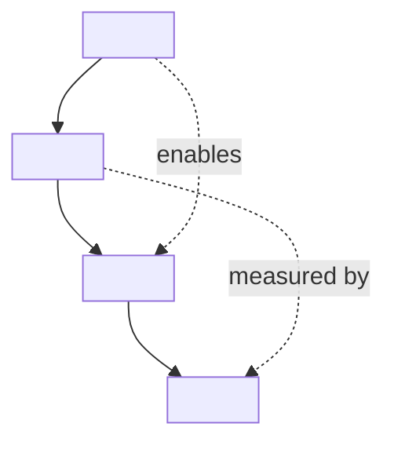

# Whitepaper — Marketing & Thought-Leadership Methodology

A whitepaper is a long-form, data-grounded document published by an organization to demonstrate expertise on a problem, propose a framework for thinking about it, and earn the right to be considered when the reader buys. Done well, it is mistaken for an industry research report; done badly, it reads as a brochure. This skill enforces the discipline that separates the two: authoritative tone, third-person voice, evidence-first arguments, and a soft, late-positioned call to action.

---

## When to Apply

Apply this methodology when the deliverable is:

- A category-defining or category-defending piece on an industry trend
- A buyer-education paper for a complex B2B product or service
- A research-driven report tied to original survey, benchmark, or proprietary data
- A regulatory- or compliance-themed paper aimed at executive readers
- A vendor-neutral framework paper used by sales, analyst relations, and PR
- A position paper for a public-affairs or policy audience

Do NOT apply this methodology for:

- A peer-reviewed scientific paper — use `academic-paper.md`
- An internal strategy report — use `business-report.md`
- An engineering design specification — use `technical-rfc.md`
- A product datasheet, feature page, or pricing page
- A sales deck or pitch document
- A blog post under 1500 words
- A press release or media statement
- A customer case study standing alone (case studies are inputs to a whitepaper, not the whole)

---

## Document Structure

The whitepaper is composed of nine blocks in fixed order.

1. **Cover** — title, subtitle, publisher, author or author team, publication date.
2. **Executive summary** — a half-page distillation for the busy executive reader.
3. **The problem** — industry context, pain points, the cost of inaction, all with data.
4. **The solution** — the approach, the principles, the framework being proposed.
5. **Evidence** — case studies, benchmarks, third-party data, citations that earn credibility.
6. **Implementation roadmap** — how a reader would actually adopt the framework.
7. **ROI / value proposition** — quantified benefits, payback period, risk reduction.
8. **About us** — short, factual, third-person.
9. **Call to action** — the next step, calibrated to where the reader is in the journey.

---

## Section-by-Section Writing Guide

### 1. Cover

Purpose: signal the topic, the publisher's authority, and the publication date in three seconds.

Include: title (8–14 words, declarative or question-form), subtitle (a single sentence framing the angle), publisher name and logo placeholder, author or author team with titles, publication date (year and quarter is acceptable), version number if revised.

What does NOT belong on the cover: marketing taglines, customer logos, calls to action, or pricing.

### 2. Executive Summary

Purpose: let a CEO, board member, or analyst extract the thesis without reading further.

Cover: the industry trend in two sentences, the central problem in two sentences, the proposed approach in two sentences, the headline benefit in one sentence, the readership and next step in one sentence.

Length: 250–400 words. Half a page. No bullet salad — full sentences.

What does NOT belong: methodology, case studies, or vendor-specific claims.

### 3. The Problem

Purpose: convince the reader that the status quo is unsustainable.

Cover:
- **Industry context**: the macro forces (regulatory, technological, demographic, economic) shaping the field today. Cite government, analyst (Gartner, IDC, Forrester), academic, or central-bank sources.
- **Pain points**: the operational, financial, and strategic costs experienced by organizations like the reader's. Quote operators and customers where possible.
- **Cost of inaction**: quantified consequences of doing nothing — lost revenue, regulatory exposure, talent attrition, customer churn. Use ranges from cited sources, not invented numbers.

Length: 2–4 pages. The most data-rich section after Evidence.

What does NOT belong: any mention of the publisher's product or service. The problem stands on its own merits.

### 4. The Solution

Purpose: propose a framework, not a feature list.

Cover:
- **Approach**: the high-level philosophy the publisher recommends (vendor-neutral wherever possible).
- **Principles**: 3–6 named principles that govern the approach. Each principle is a one-line tenet followed by a paragraph of explanation.
- **Framework**: a visual model (diagram, matrix, pyramid, lifecycle) that names the moving parts and their relationships.

Length: 3–5 pages.

What belongs here: the framework, the vocabulary the reader will adopt, the architecture of the thinking.

What does NOT belong: product screenshots, pricing, or competitive comparisons.

### 5. Evidence

Purpose: prove the framework is grounded in reality.

Cover:
- **Case studies**: 2–4 anonymized or named customer stories formatted with Context, Action, Result, each anchored to a quantified outcome.
- **Benchmarks**: industry data — original (publisher survey) is highest-value, third-party next, qualitative case anecdotes last.
- **Expert citations**: analyst quotes, academic findings, regulatory pronouncements.

Each piece of evidence is footnoted to a verifiable source.

Length: 3–6 pages.

### 6. Implementation Roadmap

Purpose: show the reader how to act on the framework over a realistic time horizon.

Use a phased model (90-day, 6-month, 12-month, multi-year), with each phase naming: the goal, the prerequisites, the activities, the success criteria, and the typical risks.

Length: 1–2 pages.

### 7. ROI / Value Proposition

Purpose: quantify the upside in language a CFO accepts.

Cover: a baseline (status quo costs), the projected post-adoption state, the delta, the payback period, the sensitivity to key assumptions. Present as a small table with conservative, base, and aggressive scenarios.

Length: 1 page. Honest. Cite assumption sources.

### 8. About Us

Purpose: establish the publisher's credibility without becoming a sales pitch.

Cover (third person): mission, founding year, scale (employees, customers, geographic footprint), notable certifications or partnerships, contact channel. 80–120 words.

What does NOT belong: customer logos as a wall, product feature lists, awards trophies. Earn credibility through the body of the paper.

### 9. Call to Action

Purpose: name the single next step calibrated to the buyer's stage.

Calibration:
- For **awareness-stage** readers: invite them to a webinar, a related research piece, a newsletter.
- For **consideration-stage** readers: invite them to a workshop, an assessment, a benchmark.
- For **decision-stage** readers: invite them to a scoping conversation or a proof of value.

Length: 50–100 words. Concrete URL or contact. One action, not five.

---

## Output Template

```markdown
# <Whitepaper title — 8–14 words, declarative or question>
## <Subtitle — one sentence framing the angle>

| Field | Value |
|---|---|
| Publisher | <Organization name> |
| Authors | <Author 1, Title>; <Author 2, Title> |
| Publication date | <YYYY-Qx> |
| Version | <1.0> |
| Length | <N pages> |

---

## Executive Summary

<Paragraph 1 — industry trend in 2 sentences and the central problem in 2 sentences.>

<Paragraph 2 — the proposed approach in 2 sentences and the headline benefit in 1 sentence.>

<Paragraph 3 — the intended readership and the recommended next step in 1 sentence.>

---

## 1. The Problem

### 1.1 Industry context
<Macro forces shaping the field today: regulatory, technological, demographic, economic. Cite authoritative sources (government, analyst, academic, central bank).>

### 1.2 Pain points
| Pain | Affected role | Frequency or scale | Source |
|---|---|---|---|
| <e.g., manual reconciliation absorbs 30% of finance team's time> | <CFO, controller> | <industry median, per <source>> | <citation> |
| <e.g., regulatory reporting cycle has compressed from 90 to 30 days> | <Compliance officer> | <jurisdictions cited> | <citation> |
| <pain 3> | <role> | <frequency> | <citation> |

### 1.3 The cost of inaction
<Quantified consequences of doing nothing over 12–36 months: lost revenue, fines, attrition, churn, market-share erosion. Use ranges from cited sources.>

> "<Operator or customer quote, attributed by role and industry, not name unless permitted>." — <Role, Industry, Year>

---

## 2. The Solution

### 2.1 Approach
<2–3 paragraphs articulating the philosophy. Vendor-neutral. The reader should be able to adopt this thinking even if they never become a customer.>

### 2.2 Principles
1. **<Principle 1 — short name>.** <Paragraph of explanation.>
2. **<Principle 2 — short name>.** <Paragraph of explanation.>
3. **<Principle 3 — short name>.** <Paragraph of explanation.>
4. **<Principle 4 — short name>.** <Paragraph of explanation.>

### 2.3 Framework



<2 paragraphs interpreting the diagram.>

---

## 3. Evidence

### 3.1 Case Study 1 — <Industry, Geography, Size>
**Context.** <The customer's starting state in 2–3 sentences.>

**Action.** <What was done: scope, duration, stakeholders.>

**Result.** <Quantified outcome with a time horizon: e.g., "reduced cycle time by 42% over 9 months, recovering 3.1 FTE annually">.

### 3.2 Case Study 2 — <Industry, Geography, Size>
**Context.** <...>

**Action.** <...>

**Result.** <...>

### 3.3 Benchmark data
<Original survey or third-party data, presented as a table or a single insight per paragraph.>

| Metric | Industry median | Top quartile | Source |
|---|---|---|---|
| <e.g., time to onboard new vendor> | <14 days> | <3 days> | <citation> |
| <metric 2> | <value> | <value> | <citation> |

### 3.4 Expert perspectives
> "<Analyst, academic, or regulator quote>" — <Name, Affiliation, Year>

---

## 4. Implementation Roadmap

### Phase 1 — Foundations (0–3 months)
- **Goal**: <e.g., baseline current state, secure executive sponsorship>
- **Prerequisites**: <data access, named owner>
- **Activities**: <list>
- **Success criteria**: <observable signal>
- **Typical risks**: <list with mitigations>

### Phase 2 — Build (3–6 months)
- **Goal**: <e.g., implement the first two principles end-to-end on one workflow>
- **Prerequisites**: <list>
- **Activities**: <list>
- **Success criteria**: <list>
- **Typical risks**: <list>

### Phase 3 — Scale (6–12 months)
- **Goal**: <e.g., roll out to remaining business units>
- **Prerequisites**: <list>
- **Activities**: <list>
- **Success criteria**: <list>
- **Typical risks**: <list>

### Phase 4 — Optimize (12+ months)
- **Goal**: <e.g., automate, benchmark, refine>
- **Activities**: <list>
- **Success criteria**: <list>

---

## 5. ROI and Value Proposition

| Driver | Conservative | Base | Aggressive | Source of estimate |
|---|---|---|---|---|
| <Cost reduction> | <€X> | <€Y> | <€Z> | <case studies §3.1, §3.2> |
| <Revenue uplift> | <€X> | <€Y> | <€Z> | <industry benchmark §3.3> |
| <Risk reduction (avoided cost)> | <€X> | <€Y> | <€Z> | <regulatory citation> |
| **Total annual value** | **<€sum>** | **<€sum>** | **<€sum>** | |
| Implementation cost | <€X> | <€Y> | <€Z> | <publisher engagement data> |
| Payback period | <N months> | <N months> | <N months> | |

Assumptions: <list the 3–5 most sensitive assumptions and their basis.>

---

## 6. About <Publisher>

<80–120 words, third person. Mission, founding year, scale, certifications. Factual. No superlatives.>

Contact: <generic email or web form URL>.

---

## 7. Recommended Next Step

<50–100 words. Name the single next action and calibrate to the audience's likely stage. Provide a concrete URL or contact.>

---

## References and Sources

1. <Author or Organization (YYYY). *Title*. Publisher. URL. Accessed YYYY-MM-DD.>
2. <Analyst firm (YYYY). *Report title*. Document ID.>
3. <Government or regulator (YYYY). *Document title*. Jurisdiction.>
4. <Academic author (YYYY). "Article". *Journal*, vol(issue), pp.>

---

## Methodology note

<For original-research whitepapers: describe the survey or benchmark methodology in 1 paragraph. Sample size, recruitment, period, instrument, limitations.>
```

---

## Style & Tone Guidelines

- **Voice**: third person throughout. The publisher is referred to by name ("Acme has observed…"), never "we", except in a signed foreword from a named executive.
- **Tone**: authoritative but not promotional. The reader should believe they are reading an industry analysis, not a sales letter.
- **Tense**: present for the framework and analysis, past for case studies, future-conditional for implications.
- **Person**: avoid first-person plural except in named foreword. Avoid second person ("you") except in the call to action.
- **Jargon**: use the reader's vocabulary, not the publisher's product vocabulary. Define every acronym on first use.
- **Quantification**: every claim is anchored to a cited source or to original research with a stated methodology. Adjectives ("significant", "transformative", "leading") without numbers are flags for revision.
- **Citation style**: numbered footnotes or Harvard inline; always include access date for web sources. Never cite the publisher's own marketing pages as evidence.
- **Product mentions**: the publisher's product or service may be named at most twice: once in About Us, once in the Call to Action. Anything more crosses into brochure territory.
- **Visuals**: prefer original frameworks and benchmark charts. Use Mermaid for conceptual diagrams. Avoid stock-photo metaphors.
- **Length discipline**: most B2B whitepapers run 8–20 pages. Anything shorter is a tip-sheet; anything longer should be split into a series.

---

## Quality Checklist

- [ ] The cover communicates topic, publisher, and date without marketing copy
- [ ] The executive summary stands alone in 250–400 words
- [ ] The Problem section cites authoritative third-party sources for every claim of scale
- [ ] The Cost of Inaction is quantified with a time horizon
- [ ] The Solution proposes a framework, not a product
- [ ] The framework is depicted in at least one original diagram
- [ ] At least two case studies follow Context-Action-Result with quantified outcomes
- [ ] Benchmark data is sourced and dated
- [ ] The Implementation Roadmap is phased with success criteria
- [ ] ROI is presented in conservative-base-aggressive scenarios with assumptions
- [ ] The publisher is named at most twice in the body of the paper
- [ ] The Call to Action is calibrated to the buyer's stage and names one next step
- [ ] References are verifiable and dated
- [ ] No first-person plural outside the named foreword
- [ ] No marketing adjectives without numbers

---

## Common Mistakes

- **Brochure in disguise.** Mentioning the product in every section destroys credibility. Earn the right to be considered.
- **Original research that is not.** Citing a vendor-funded "survey" of fewer than 100 respondents as industry truth invites scrutiny. Disclose methodology.
- **Stock framework with a new label.** Renaming SWOT or PESTEL does not constitute thought leadership. Add genuine novelty or build on the canonical model explicitly.
- **Case studies without numbers.** "Customer X was very satisfied" is not evidence. Quantify the outcome and the time horizon.
- **ROI without assumptions.** A single payback figure without the underlying assumptions is unfalsifiable and reads as sales fiction.
- **Second-person sales copy.** "You need" and "you will" turn a whitepaper into a pitch. Use third person.
- **Citations that do not exist.** Made-up or stale references are the fastest way to destroy a publisher's authority. Verify every URL and date.
- **Burying the framework.** The framework — the central intellectual contribution — should appear by page 4 of a 12-page paper, not on page 11.
- **Generic CTAs.** "Contact us to learn more" is wasted real estate. Name a specific next step calibrated to the reader's stage.
- **Over-designed cover, under-researched body.** Aesthetics do not substitute for evidence. Spend the budget on data.
- **Length inflation.** Padding a 6-page argument into a 20-page document with stock photos and pull-quotes signals weakness. Cut to the strongest version.
- **Confusing thought leadership with opinion.** Thought leadership is opinion grounded in evidence. Opinion without evidence is a blog post.
